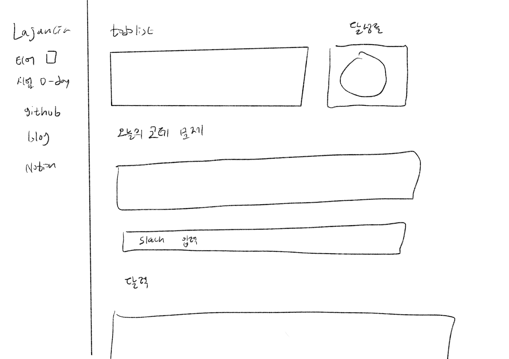
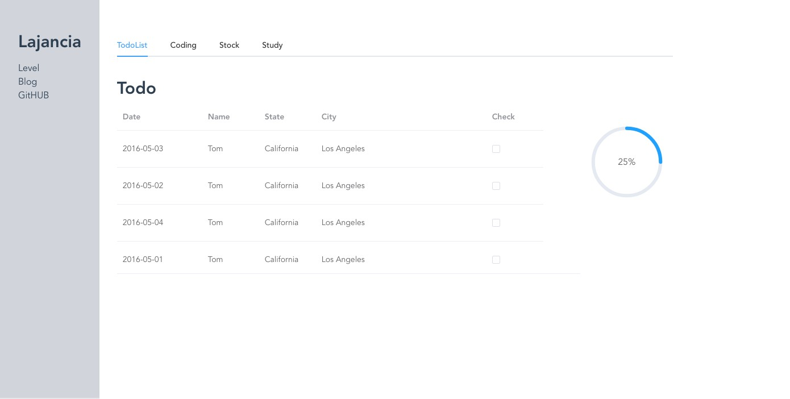

# 1. Vue.js 웹페이지 만들기

---

> 백엔드 프론트엔드 활용을 위해 Node.js로 서버를 구축하고 vue.js로 웹페이지를 만들어보도록 한다.

> 필요한 모든 기능들은 일단 넣고 생각하는 웹페이지 구축을 목표로 한다.

## 기능

1. Todolist와 달성률
2. 백준 코딩 문제 크롤링
3. 코딩 입력창
4. 백준 티어
5. 달력
6. 주식 현황

## 필요한 기술

1. vue.js + tailwindcss + element UI → frontend
2. Node.js →backend
3. 아마도 mysql
4. 데이터 크롤링
5. slack 연결

## 전체 구성



- 상단에 메뉴를 만드는 것도 고려
- todolist 가져올 곳 정하기(직접 입력할건지, 클롤링해올건지)

## 프론트엔드 작성

위의 구성을 바탕으로 프론트엔드 기능을 하나씩 구현해보도록 한다.

1. vue-cli

   vue CLI 공식 홈페이지에서 제공하는 방법에 따라 vue-CLI 파일을 생성한다.

   vue3를 설치하였다.

1. tailwindcss 설치

   ```python
   npm i vue-cli-plugin-tailwind
   vue add tailwind
   ```

   위를 실행하면 간단하게 tailwindcss를 사용 가능하다

1. element-UI 설치

   ```python
   yarn add element-plus
   ```

   ```python
   import { createApp } from 'vue'
   import ElementPlus from 'element-plus'
   import 'element-plus/dist/index.css'
   import App from './App.vue'

   const app = createApp(App)

   app.use(ElementPlus)
   app.mount('#app')
   ```

   - vue의 main.js에 위의 코드를 넣는다.
   - 이때 tailwindcss 코드가 삭제되지 않도록 주의한다.

## TodoList



- tailwindcss와 element ui를 이용하여 Todolist의 기능을 할 페이지를 구성한다.

> 만약 express generator가 설치되지 않는다면 `sudo npm install express-generator -g` 를 사용하도록 한다. 맥일 경우 권한 문제로 설치되지 않는 경우가 있다.
