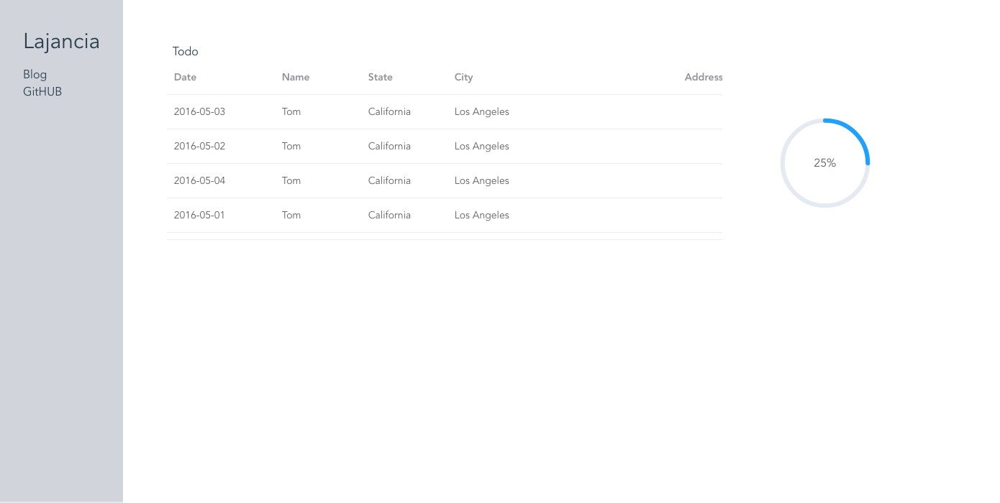

# 2. Vue.js 웹페이지 만들기

---

> vue.js와 node.js 서버로 연동을 하려기에 앞서, express로 백엔드 개발환경을 세팅해야 한다고 한다.

> node.js는 자바스크립트 런타임이다. 서버의 기능을 수행할 수 있지만, 서버라고 할 수는 없다.

> node.js를 백엔드라고 부르기에는 프론트엔드 기능도 수행 가능하다. 이는 Django도 마찬가지다.

## 참고 블로그

[Vue.js + Express + MySQL로 Node API 서버 구성하기 Quick Start - Part 1](https://medium.com/hivelab-dev/vue-express-mysql-part1-98f68408d444)

## 백엔드 개발환경

```python
npm install -g express-generator
express --view=pug backend

cd backend
npm install
npm start #localhost:3000번에서 돌아감
```

## 프론트엔드 연결

vue.config.js

```python
module.exports = {
  devServer: {
    proxy: {
      '/api': {
        target: 'http://localhost:3000/api',
        changeOrigin: true,
        pathRewrite: {
          '^/api': ''
        }
      }
    }
  },
  outputDir: '../backend/public',
}
```

- 위의 파일을 추가하고 난 뒤, npm run build를 진행하면 backend 파일의 public 구조가 변경된다.

backend/todo.js

```python
[
        {
          "date": "2016-05-03",
          "name": "Tom",
          "state": "California",
          "city": "Los Angeles",
          "zip": "CA 90036"
        },
        {
          "date": "2016-05-02",
          "name": "Tom",
          "state": "California",
          "city": "Los Angeles",
          "zip": "CA 90036"
        },
        {
          "date": "2016-05-04",
          "name": "Tom",
          "state": "California",
          "city": "Los Angeles",

          "zip": "CA 90036"
        },
        {
          "date": "2016-05-01",
          "name": "Tom",
          "state": "California",
          "city": "Los Angeles",

          "zip": "CA 90036"
        },
        {
          "date": "2016-05-08",
          "name": "Tom",
          "state": "California",
          "city": "Los Angeles",

          "zip": "CA 90036"
        },
        {
          "date": "2016-05-06",
          "name": "Tom",
          "state": "California",
          "city": "Los Angeles",

          "zip": "CA 90036"
        },
        {
          "date": "2016-05-06",
          "name": "This is test",
          "state": "successfully connected",
          "city": "Los Angeles",

          "zip": "CA 90036"
        }
      ]
```

- 추후에 프론트엔드에서 사용할 데이터들을 저장해둔다.

backend/routes/todo.js

```python
var express = require('express');
var router = express.Router();
var todo = require('../todo.json');
router.get('/', function (req, res, next) {
 res.send(todo)
});
module.exports = router;
```

backend/app.js 추가

```python
var moviesRouter = require('./routes/todo');
app.use('/api/todo', todoRouter);
```

- 프론트엔드에서 api로 요청을 보내면 라우터를 통해 데이터 처리한다.

front_end/src/main.js

```python
import { createApp } from 'vue'
import ElementPlus from 'element-plus'
import 'element-plus/dist/index.css'
import App from './App.vue'
import './assets/tailwind.css'
import axios from 'axios'
import VueAxios from 'vue-axios'

const app = createApp(App)
app.use(VueAxios, axios)
app.use(ElementPlus)
app.mount('#app')
```

- element-plus와 tailwindcss, axios, vue-axios를 사용한다.
- 이때 poscss 에러가 발생하면 `npm install tailwindcss@npm:@tailwindcss/postcss7-compat postcss@^7 autoprefixer@^9` 를 설치하도록 한다.

## 실행

백엔드는 3000번에서 동작하고 프론트엔드를 npm run build를 실행시킨 뒤 로컬 호스트를 열어보면 아래와 같이 데이터를 잘 받아오는 것을 확인할 수 있다.



- 프론트엔드에 문제가 생겨서 마지막으로 깃허브에 저장해둔 디자인으로 롤백되었다. 다시 원래대로 고쳐야 한다.
